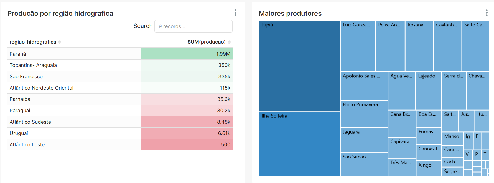

# Dashboard produção em aguasda união

Este projeto configura um ambiente completo com MariaDB, PhpMyAdmin e Apache Superset via Docker Compose. O Superset foi customizado para incluir automaticamente o driver MySQL necessário para conectar ao banco MariaDB. As credenciais ficam armazenadas no arquivo `.env` para maior segurança e facilidade.

---

## Tecnologias usadas

- Docker & Docker Compose  
- MariaDB (servidor de banco de dados MySQL compatível)  
- PhpMyAdmin (interface web para gerenciamento do banco MariaDB)  
- Apache Superset (ferramenta open source para visualização e dashboards)  


---

## Como usar

### 1. Configurar o arquivo `.env`

Copie o arquivo `.env.example` e crie um `.env` e ajuste as variáveis conforme seu ambiente:

```env
# ───── PostgreSQL (metadados do Superset) ─────────────
POSTGRES_USER=usuario
POSTGRES_PASSWORD=senha
POSTGRES_DB=banco

# ───── MariaDB (fonte de dados dos relatórios) ────────
MARIADB_ROOT_PASSWORD=root
MARIADB_USER=usuario
MARIADB_PASSWORD=senha
MARIADB_DATABASE=banco

# ───── phpMyAdmin ─────────────────────────────────────
PMA_HOST=mariadb
PMA_PORT=3306

# ───── Superset ───────────────────────────────────────
SUPERSET_SECRET_KEY=secret_key
ADMIN_USERNAME=usuario
ADMIN_PASSWORD=senha
ADMIN_FIRSTNAME=nome
ADMIN_LASTNAME=sobrenome
ADMIN_EMAIL=email
SUPERSET_CONTAINER_NAME=superset_app

2. Subir os containers
No terminal, na raiz do projeto, execute:

docker-compose up --build

Isso irá subir os containers:

MariaDB (banco de dados)
PhpMyAdmin (interface web para MariaDB)
Apache Superset (com driver MySQL instalado)

O banco de dados esta na pasta mariadb.

Dados disponiveis em: https://dados.gov.br/dados/conjuntos-dados/lista-de-produo-de-piscicultura-em-guas-da-unio




